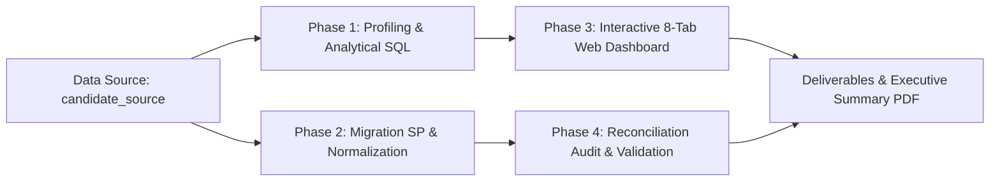

# Technical Test Data Analyst — PT Kosmetika Klinik Indonesia

[](https://kosmetika-klinik-data-analyst.vercel.app/)
[](https://github.com/alfitranurr/kosmetika-klinik-data-analyst)
[](https://kosmetika-klinik-data-analyst.vercel.app/)

> **Executive Summary & Interactive Analytics Platform** untuk evaluasi performa bisnis klinik kosmetik kuartal ke-4 tahun 2022 (Oktober – Desember 2022) di 4 cabang, serta migrasi dan validasi data pasien legacy (*candidate_source* ke *candidate_target*).

---

## 👤 Identitas Kandidat

- **Nama Lengkap:** Al Fitra Nur Ramadhani  
- **Pendidikan:** S1 Sarjana Informatika — Universitas Muhammadiyah Malang (UMM)  
- **Fokus Keahlian:** Data Science, Data Analytics, Business Intelligence & AI Automation  
- **Email:** [alfitranurr@gmail.com](mailto:alfitranurr@gmail.com)  
- **Web Portfolio:** [https://alfitranurr.vercel.app](https://alfitranurr.vercel.app)  
- **GitHub Repository:** [https://github.com/alfitranurr/kosmetika-klinik-data-analyst](https://github.com/alfitranurr/kosmetika-klinik-data-analyst)  
- **Live Web Dashboard:** [https://kosmetika-klinik-data-analyst.vercel.app](https://kosmetika-klinik-data-analyst.vercel.app/)  

---

## 🖼️ Tangkapan Layar Interactive Web Dashboard


---

## 📌 Latar Belakang

PT Kosmetika Klinik Indonesia mengoperasikan klinik kecantikan dan perawatan kulit di beberapa kota. Dalam rangka meningkatkan kualitas keputusan bisnis berbasis data dan modernisasi infrastruktur sistem informasi klinik, manajemen melakukan dua agenda teknis utama:

1. **Evaluasi Kinerja Bisnis (Q4 2022):** Mengevaluasi pencapaian revenue, retensi pasien, efektivitas layanan treatment medis, penjualan skincare, serta kontribusi dokter dan cabang periode Oktober – Desember 2022 pada database operasional (`candidate_source` — *read-only*).
2. **Migrasi Data Pasien Legacy:** Mengintegrasikan 21.993 data pasien dari sistem lama ke skema database baru (`candidate_target`) secara *safe*, *clean*, *traceable*, dan *idempotent* tanpa mengganggu integritas data yang ada.

---

## 🎯 Tujuan Proyek

1. **SQL & Pemahaman Data:** Profiling kualitas data, verifikasi volume data, deteksi data NULL/duplikat, integritas relasi antar tabel, dan pencegahan *double counting revenue*.
2. **Analisis Bisnis & Visualisasi:** Menghasilkan 5 insight bisnis utama berbasis angka konkret, evaluasi mendalam cabang prioritas (Sidoarjo), serta menyusun 3 *priority action plan* yang terukur.
3. **Migrasi & Validasi Rekonsiliasi:** Membangun *Stored Procedure* migrasi aman berbasis *business rules* normalisasi telepon, gender, tanggal lahir, dan penanganan RM code duplikat/kosong dengan bukti rekonsiliasi 100%.

---

## 🛠️ Tech Stack & Metadata Tools

- **Database Engine:** MySQL 8.0 / SQLite3 (Analytical Queries, CTE, Window Functions, Stored Procedures, Dynamic Triggers)
- **Frontend / Dashboard Framework:** React.js (Vite), Tailwind CSS, Recharts (Data Visualization), Lucide React (Icons)
- **Deployment Platform:** Vercel (Automated CI/CD Git Pipeline)
- **Data Analytics & Scripting:** Python 3.10 (Pandas, SQLite3), Markdown, ReportLab / PDF Engine

---

## 🔄 Workflow Pengerjaan



1. **Phase 1 — Data Profiling & Business Analytics:** Menyusun `01_profiling_and_analysis.sql` untuk profiling volume data, data kosong/duplikat, transaksi non-member, serta analisis performa kuartalan (Q4 2022).
2. **Phase 2 — Stored Procedure Migration:** Menyusun `02_patient_migration.sql` berisi `sp_migrate_patient_data()` untuk memigrasikan pasien dengan *rules* normalisasi HP, gender, DOB, dan RM code.
3. **Phase 3 — Reconciliation & Validation:** Menyusun `03_migration_validation.sql` untuk membuktikan rekonsiliasi 100%, uji *idempotency re-run*, dan audit integritas referensial.
4. **Phase 4 — Web Dashboard & Executive Reporting:** Membangun Dashboard Web Interaktif 8-Tab yang ter-deploy di Vercel dan menerbitkan `executive_summary.pdf`.

---

## 📑 Rincian Berkas Deliverables

Seluruh berkas pengerjaan tersimpan secara rapi dalam folder `Al_Fitra_Nur_Ramadhani/`:

```
Al_Fitra_Nur_Ramadhani/
├── 01_profiling_and_analysis.sql               # Script SQL Profiling, Performa Bisnis, Segmentasi, Product/Doctor, & Deep-Dive Sidoarjo
├── 02_patient_migration.sql                    # Script SQL Stored Procedure Migrasi Pasien (Safe, Normalisasi, & Audit Logging)
├── 03_migration_validation.sql                 # Script SQL Validasi Rekonsiliasi, Audit Integrity, & Uji Idempotensi Re-run
├── dashboard/                                  # Web Dashboard Source Code (React + Tailwind + Recharts)
├── Dashboard - PT Kosmetika Klinik Indonesia.png# Screenshot Tampilan Web Dashboard Interaktif
├── executive_summary.pdf                       # Dokumen PDF Executive Summary 2 Halaman
└── README.md                                   # Dokumentasi Utama & Petunjuk Eksekusi
```

---

## 📊 Summary Hasil Analisis Bisnis (Bagian 1 A – E)

### 1. Matriks Kinerja Bulanan & Perbandingan Cabang (Q4 2022)

Total Revenue Q4: **Rp 24,33 Miliar** | Total Invoice: **50.856 Invoice** | Pasien Unik: **21.993 Pasien** | ATV Rata-rata: **Rp 478.488**

| Bulan       | Cabang   | Total Revenue (IDR) | Total Invoice | Pasien Unik | ATV (IDR)  | MoM Growth | Kontribusi Cabang |
| :---------- | :------- | :-----------------: | :-----------: | :---------: | :--------: | :--------: | :---------------: |
| **2022-10** | MALANG   |  Rp 1.706.668.300   |     3.753     |    2.301    | Rp 454.748 |     -      |      21,08%       |
| **2022-10** | SURABAYA |  Rp 3.115.396.800   |     5.795     |    3.881    | Rp 537.601 |     -      |      38,48%       |
| **2022-10** | BANDUNG  |  Rp 2.185.006.450   |     4.836     |    3.594    | Rp 451.821 |     -      |      26,99%       |
| **2022-10** | SIDOARJO |  Rp 1.088.802.900   |     2.884     |    1.822    | Rp 377.532 |     -      |      13,45%       |
| **2022-11** | MALANG   |  Rp 1.689.014.000   |     3.530     |    2.271    | Rp 478.474 |   -1,03%   |      21,86%       |
| **2022-11** | SURABAYA |  Rp 2.755.728.900   |     5.469     |    3.614    | Rp 503.882 |  -11,54%   |      35,67%       |
| **2022-11** | BANDUNG  |  Rp 2.110.099.300   |     4.493     |    3.372    | Rp 469.642 |   -3,43%   |      27,31%       |
| **2022-11** | SIDOARJO |  Rp 1.170.661.700   |     2.562     |    1.645    | Rp 456.933 |   +7,52%   |      15,15%       |
| **2022-12** | MALANG   |  Rp 1.783.965.150   |     3.779     |    2.495    | Rp 472.073 |   +5,62%   |      20,96%       |
| **2022-12** | SURABAYA |  Rp 3.064.977.550   |     5.789     |    3.880    | Rp 529.449 |  +11,22%   |      36,01%       |
| **2022-12** | BANDUNG  |  Rp 2.315.223.170   |     4.952     |    3.591    | Rp 467.533 |   +9,72%   |      27,20%       |
| **2022-12** | SIDOARJO |  Rp 1.348.460.300   |     3.014     |    1.901    | Rp 447.399 |  +15,19%   |      15,84%       |

---

### 2. Segmentasi Customer & Perilaku Belanja

- **Repeat Customer:** Menyumbangkan **66,35% revenue (Rp 16,15 M)** dari 31.044 invoice (ATV Rp 520.117).
- **Reactivated Customer:** Menyumbangkan **13,13% revenue (Rp 3,20 M)** dari 5.156 invoice (ATV Rp 619.836).
- **New Customer:** Menyumbangkan **12,87% revenue (Rp 3,13 M)** dari 4.176 pasien baru dengan **ATV tertinggi (Rp 749.905)**.
- **Non Member:** Menyumbangkan **7,64% revenue (Rp 1,86 M)** dari 10.480 invoice dengan **ATV terendah (Rp 177.482)**.

---

### 3. Top Treatment, Top Produk, & Tipe Transaksi

- **Hero Treatment (#1):** `SKIN BOOSTER 3 IN 1 1CC` (**Rp 609,93 Jt** / 385 transaksi).
- **Hero Skincare (#1):** `WHITENING SUN CREAM 3` (**Rp 1,61 Miliar** / 12.948 unit terjual).
- **Mixed Package Power:** Transaksi *Mixed* (Treatment + Skincare) menghasilkan **ATV Rp 1.432.772** (5x lipat dibanding *Product Only* Rp 276rb).

---

### 4. Deep-Dive Cabang Prioritas: CABANG SIDOARJO

- **Alasan Pemilihan:** Sidoarjo berkinerja terendah dengan kontribusi revenue hanya **14,83% (Rp 3,61 M)**, ATV terendah (**Rp 426.468**), dan porsi transaksi *Mixed* paling rendah (**11,61%**).
- **Akar Masalah:** Kurangnya efektivitas *cross-selling* treatment ke skincare oleh tim medis, serta tingginya porsi pembeli Non-Member (26,2% invoice) yang belum terkonversi menjadi member terdaftar.

---

## 💡 5 Insight Berbasis Angka & 3 Action Plan Prioritas (Bagian 2)

### 💡 5 Insight Utama

1. **Konsentrasi Revenue:** Surabaya & Bandung menguasai **63,88% (Rp 15,54 M)** pendapatan total klinik.
2. **Dominasi Pasien Loyal:** Repeat Customer menyumbang **66,35% (Rp 16,15 M)** total pendapatan.
3. **Daya Beli Pasien Baru Tinggi:** New Customer memiliki ATV tertinggi (**Rp 749.905**), 42% di atas rata-rata ATV bisnis.
4. **Potensi Transaksi Mixed:** Transaksi *Mixed* menghasilkan ATV Rp 1.43M (menyumbang 41,83% revenue dari hanya 14.0% volume invoice).
5. **Peluang Konversi Non Member:** 10.480 invoice Non Member (20.6%) memiliki ATV rendah (Rp 177rb) yang siap dikonversi ke membership.

---

### 🎯 3 Priority Action Plan

#### **Action Plan 1: Revitalisasi & Upselling Cabang Sidoarjo**
- **Masalah:** Sidoarjo memiliki kontribusi revenue (14.8%) dan ATV terendah (Rp 426rb).
- **Tindakan:** Bundling promo khusus *Skin Booster / Pico Clear* + Skincare Homecare & Pelatihan *Cross-selling*.
- **Target:** Menaikkan ATV Sidoarjo dari Rp 426rb ke **Rp 480.000 (+12,5%)**.
- **PIC:** Branch Manager Sidoarjo & Head of Medical.
- **KPI:** Growth Revenue Sidoarjo +15% MoM.
- **Target Waktu:** Q1 2023 (1-2 Bulan).

#### **Action Plan 2: Program Konversi Non-Member Instan di Kasir**
- **Masalah:** 10.480 invoice Non-Member (20,6%) belum memiliki profil terdaftar dan ber-ATV rendah.
- **Tindakan:** Registrasi member instan di kasir dengan reward voucher diskon 10% transaksi berikutnya.
- **Target:** Konversi 40% Non-Member menjadi Member Resmi (**4.000+ member baru**).
- **PIC:** CRM Lead & Front Office Supervisor.
- **KPI:** Pendaftaran Member Baru +4.000 Pasien.
- **Target Waktu:** 1 Bulan (Januari 2023).

#### **Action Plan 3: SOP Konsultasi Dokter untuk Mixed Package**
- **Masalah:** 79.2% transaksi masih *Product Only* (ATV Rp 276rb), belum memaksimalkan *Mixed Package* (ATV Rp 1.43M).
- **Tindakan:** Wajibkan SOP konsultasi dokter untuk merekomendasikan skincare pendukung pasca-treatment.
- **Target:** Meningkatkan porsi transaksi Mixed dari 14,0% ke **25,0%**.
- **PIC:** Commercial Lead & Lead Doctor.
- **KPI:** Porsi Transaksi Mixed mencapai 25% dari total invoice.
- **Target Waktu:** 2 Bulan (Jan-Feb 2023).

---

## 🛡️ Hasil Rekonsiliasi Migrasi Pasien (Bagian 3)

```text
Dataset / Indicator                                                 Jumlah Record   Status Validation
------------------------------------------------------------------------------------------------------
Source Patients (candidate_source.source_patients)                      21.993       100% Data Preserved
Target Patients (candidate_target.patients)                            21.993       100% Success Migrated
Patient Legacy Mappings (candidate_target.patient_legacy_mappings)     21.993       100% Traceability
Logged Migration Conflicts (candidate_target.migration_conflicts)         640       100% Audit Logged

Target Patients Tanpa Legacy Mapping                                        0       PASSED (Clean)
Legacy Mappings Tanpa Target Patient                                        0       PASSED (Clean)
Orphan Foreign Keys (Pekerjaan, Agama, Info Source)                          0       PASSED (Clean)
Post Re-Run Target Patients Count (Idempotency Test)                   21.993       PASSED (No Duplicate)
```

---

## 🚀 Panduan Eksekusi SQL Script

Seluruh script SQL telah dirancang aman, kompatibel dengan MySQL 8.0+, dan bersifat *idempotent*:

### 1. Eksekusi SQL Profiling & Business Analysis
```bash
mysql -u root -p candidate_source < 01_profiling_and_analysis.sql
```

### 2. Eksekusi Stored Procedure Migrasi Data Pasien
```bash
mysql -u root -p candidate_target < 02_patient_migration.sql
```

### 3. Eksekusi SQL Validasi & Rekonsiliasi
```bash
mysql -u root -p candidate_target < 03_migration_validation.sql
```

---

### 📌 Catatan Penutup & Portofolio
Proyek ujian teknis ini dikerjakan dengan standar profesionalisme tinggi, mengedepankan akurasi angka, kebersihan *codebase*, keamanan migrasi data, serta estetika visualisasi eksekutif modern.

Portofolio lengkap dan proyek visualisasi data interaktif lainnya dapat dilihat melalui situs resmi kandidat:  
👉 **[https://alfitranurr.vercel.app](https://alfitranurr.vercel.app)**
